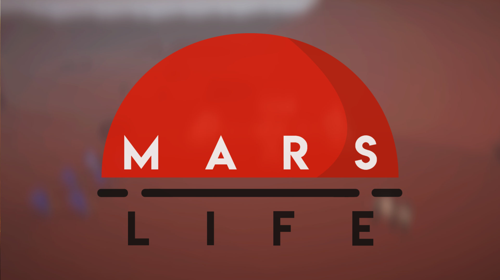

# Mars Life

Mars Life è il progetto finale sviluppato nella Digital Bros Game Academy.
È un gioco esplorativo in terza persona in cui il giocatore controlla uno dei quattro membri dell'equipaggio mandato in missione su Marte per iniziare una sua colonizzazione.
Durante l'esplorazione il giocatore dovrà compiere determinate missioni per rendere più accogliente l'ambiente circostante e per risolvere problemi che si vengono a creare nella base.
Gli altri membri dell'equipaggio hanno il ruolo di assegnare le varie missioni e di donare al personaggio principale dei gadget particolari che gli permetteranno di muoversi più agevolmente e di superare ostacoli nei vari scenari di gioco.
La mappa di gioco è composta da quattro diversi scenari in cui si potrà viaggiare tramite l'ausilio del rover! I vari scenari verranno sbloccati con il prosieguo delle varie missioni.
In più vi sono dei collezionabili, sparsi nei vari scenari, che sbloccano trofei all'interno della base.
Il gioco è stato totalmente creato con l'engine Unity.
Per la sua realizzazione ho lavorato in un team di tre programmatori ricoprendo il ruolo di leader. 
Le features che sono state implementate da me riguardano:
- Implementazione del sistema delle quest
- Implementazione del sistema dei gadget
- Implementazione di parte dell'HUD (feedback dei vari gadget e dei testi delle varie quest)
- Implementazione di parte del salvataggio e del caricamento
- Implementazione dei vari dialoghi con gli altri membri dell'equipaggio
- Fixing di bug relativi ai plugin di movimento di personaggio e camera
